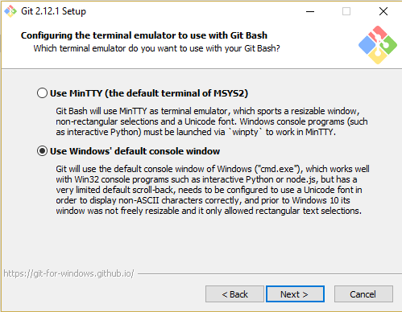
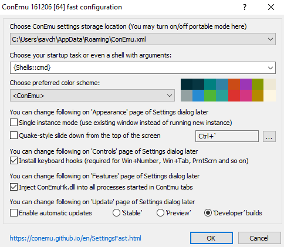
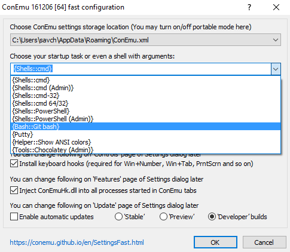
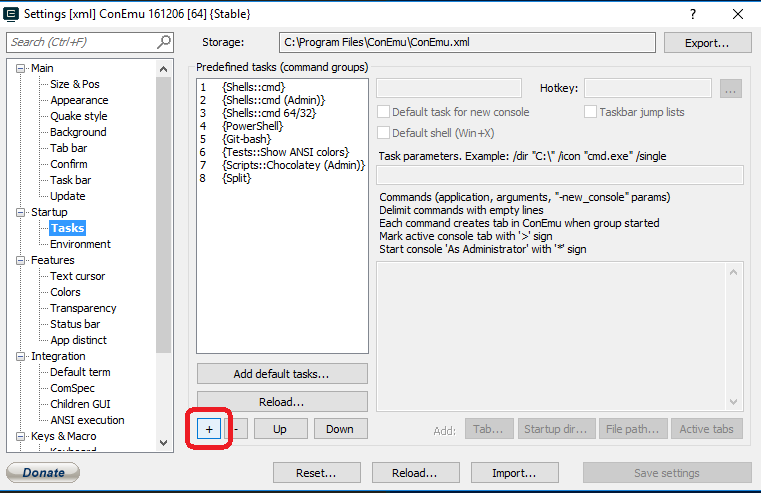
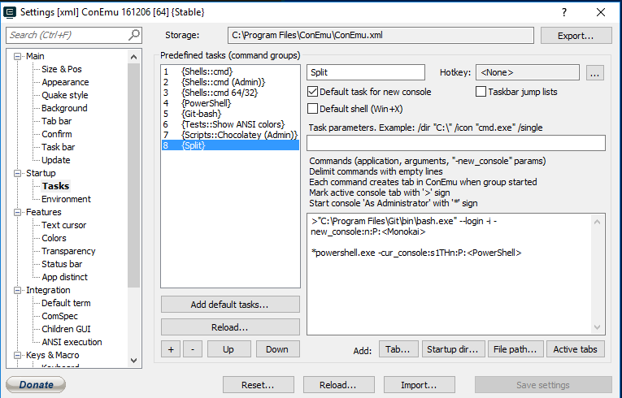
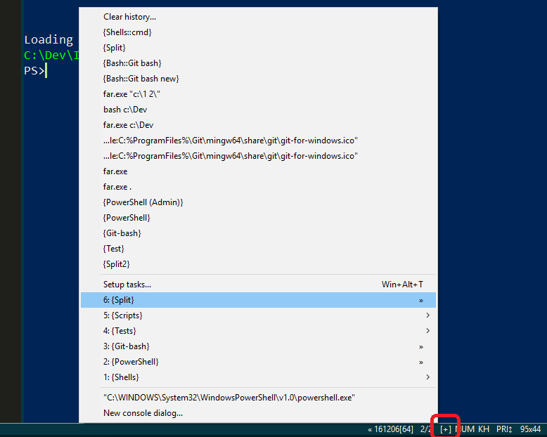

# Lab 1 — Install the tools

## Mac
### Tools
Most of the basic Unix tools are already installed on a Mac, so there's no need to do anything special (before you feel too smug about it though, check the version of the packaged bash by running `bash --version`).

### Console
Built-in Terminal is not too bad, but there are many ways working with shell can me made more comfortable. iTerm2 is an excellent free alternative. You can read about its features [here](https://www.iterm2.com/features.html). Some of my personal favourites:
* tabs and split panes
* [session restoration](https://www.iterm2.com/documentation-restoration.html)
* *lots* of [colour schemes](http://iterm2colorschemes.com/)

Install iTerm2 it from [here](https://www.iterm2.com/downloads.html).

## Windows
Improving command line experience on Windows is a tad more involved exercise (well, that's one way to put it).

### Tools
To get Unix tools, download and install [Git for Windows] (https://git-scm.com/download/win). This is a reasonably straightforward process and you can accept most of the defaults, with one exception — choose `Windows' default console` instead of MinTTY:



MinTTY is known to cause some issues, and we won't be using default Git console anyway.

After you install Git, you can find the tools in `C:\Program Files\Git\usr\bin`. This is a usefult place to know if you want, for example, to [change the default shell in Visual Studio Code to bash](https://code.visualstudio.com/docs/editor/integrated-terminal#_configuration), or if you want to launch `vim` from PowerShell (just add this folder to the system `PATH`).

### Console
Default [Win32 console](https://en.wikipedia.org/wiki/Win32_console) is not that great in the UX department, so it's best to replace it with something decent and never look back. ConEmu is arguably the best option available on Windows. You can read more about its features [here](https://conemu.github.io/en/) and download it from [here](https://www.fosshub.com/ConEmu.html).
Two important notes:
* ConEmu is a console, not a shell — so it's not a replacement for `cmd.exe` or Powershell. In fact, it can be used as a UI for both of them.
* There is a preconfigured version called [`cmder`](http://cmder.net/) — it is essentially ConEmu + [clink](https://mridgers.github.io/clink/) (which adds completion, history, and line-editing capabilities to default `cmd.exe`) + Git + some visual improvements. It's a good option if you want something functional and beautiful out of the box.

After installing ConEmu (all defaults are fine) and launching it for the first time you will be presented with this screen:



Here we can make a couple changes:
* Select Git bash as default shell



* Choose a preferred colour scheme — Monokai is always a good choice, but ultimately you'd want something that works best for you. You can alway change it later.

#### Bonus points — configure a split pane task with git-bash and Powershell

ConEmu settings are store at `C:\Program Files\ConEmu\ConEmu.xml` by default, so you would need to launch the console as Administrator to be able to store the modified settings. Alternatively, you can export the default system settings to another location so that you don't need to elevate your privileges.

Navigate to Settings > Tasks and add a new task



Put the following snippet in the `Commands` input field (you can also make it the default for new console):
```
>"C:\Program Files\Git\bin\bash.exe" --login -i -new_console:n:P:<Monokai>

*powershell.exe -cur_console:s1THn:P:<PowerShell>
``` 



Save the Settings and try launching the new task by clicking the small `+` symbol in the gutter:



More info on tweaking ConEmu can be found [here](http://conemu.github.io/en/Settings.html#id1610).